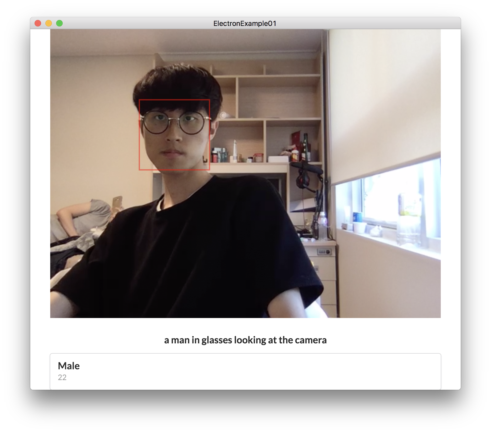

# Summary

* [Introduction](README.md)
* [Setup Environment](chapter1.md)
* [Setup Libraries](chapter2.md)
* [Start Electron](chapter3.md)
* [Build Structure](chapter4.md)
* [Show WebCAM stream in Electron](chapter5.md)
* [Capture WebCAM stream](chapter6.md)
* [Detect Face with Cognitive API](chapter7.md)

# Angular-Electron

이 문서는 Typescript를 기본으로한, Angular2와 Electron을 이용해 Desktop Application을 만드는 것에 대해 다룹니다.

## WebCAM Stream and Cognitive
이 문서는 WebCAM Stream과 Cognitive를 이용해서 `Electron`을 활용하여 얼굴 감지 `App`을 만드는 방법에 대하여 기술합니다.

`Angular2`, `Electron`와 `Typescript` 초보자 대상으로 만들어졌습니다.

완성된 형태는 위와 같습니다.

# What is Electron?

`Electron`은 Chromium과 `Node.js`를 이용하여 데스크톱 앱을 `HTML`, `CSS`, `JS(Typescript)`로 쉽게 만들 수 있게 해주는 `Framework`입니다. 본래는 Github에서 Atom Editor를 개발하기 위하여 시작된 프로젝트로, Atom Shell이라는 이름으로 시작되었다가 Electron으로 이름이 바뀌었습니다.

`Electon`의 장점은 기존의 웹 기술을 이용하여 손쉽게 Cross-platform 데스크톱 앱을 개발 할 수 있습니다. 이미 웹으로 만들어진 서비스라면 익숙한 언어와 코드를 재사용하여 쉽게 데스크톱 앱을 개발할 수 있게 됩니다.
