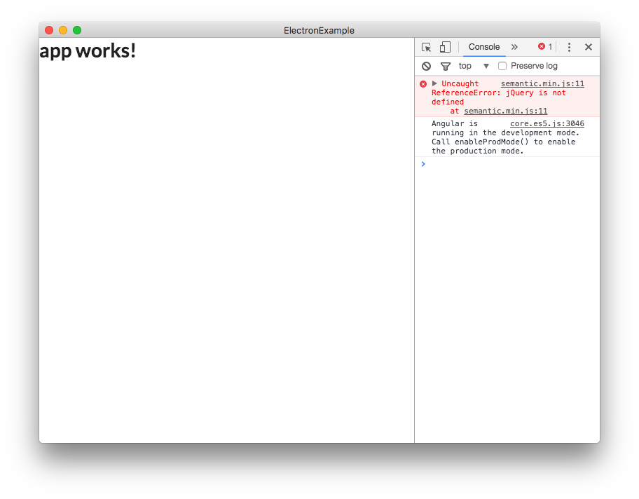

# Setup Libraries
Electron으로 개발하기에 앞서 디자인을 도와줄 `Semantic-UI`와 `jQuery`를 설치하는 법을 배워보도록 합시다.


## jQuery
`jQuery`는 너무나도 유명한 `javascript` 라이브러리입니다. `Semantic-UI`를 사용하기 위해서는 `jQuery`가 필수적으로 설치되어 있어야하기 때문에 먼저 설치를 해줍니다.

### npm jQuery 설치

```Bash
$ npm install jquery
```

## Semantic-UI
`Semantic-UI`는 UI Library의 카테고리에 속하는 제품입니다. 이 도구는 잘 만들어진 기본 부품(component)를 제공합니다. 이 부품들을 활용해서 빠르게 서비스를 구현할 수 있고, 필요에 따라서는 개조해서 사용할수도 있습니다.

우리는 `Angular2`에 맞춰져 있는 `ngSemantic`을 이용하도록 하겠습니다.
`ngSemantic`Link: <https://ng-semantic.herokuapp.com/#/>

### Semantic-UI 설치
`Semantic-UI` 설치는 간단합니다. 이전의 일반 `html`코딩하던 것 처럼 `index.html`의 `<head>`태그 안에 `semantic.js`와 `semantic.css`파일을 추가해주면 됩니다.

```html
<!-- /src/index.html -->
<head>
  ...
  <link rel="stylesheet" type="text/css" href="https://cdnjs.cloudflare.com/ajax/libs/semantic-ui/2.2.2/semantic.min.css">
  <script src="https://cdnjs.cloudflare.com/ajax/libs/semantic-ui/2.2.2/semantic.min.js"></script>
  ...
</head>
```

이제 한번 Electron을 실행시켜 봅시다.

```Bash
$ ng build --watch
$ npm run electron
```

그리고 우리는 한 에러에 직면하게 됩니다.




### Electron에서 jQuery를 로드하는 방법
기타 다른 라이브러리와 다르게 jQuery의 경우에는 Electron 환경을 크롬과 다른 환경으로 인식, Common JS환경으로 인식하기 때문에 jQuery를 전역변수로 설정하지 않는다 따라서 jQuery를 Electron에서 사용하기 위해서는 별도의 설정이 필요합니다.

npm에서 jQuery를 설정했다면 이와 같이 설정하면 됩니다.

```javascript
window.$ = window.jQuery = require('jquery');
```
