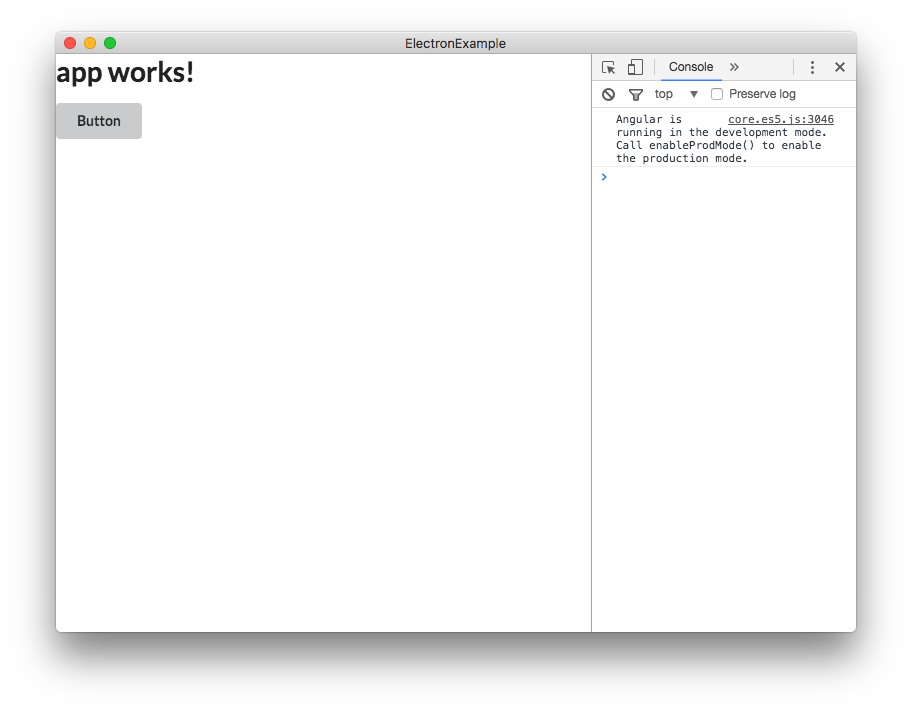
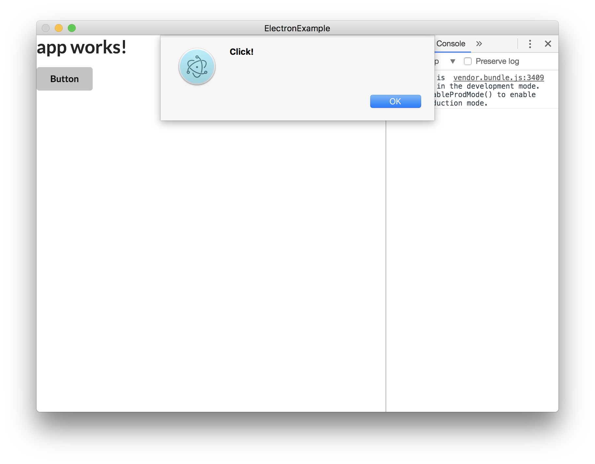

# Start Electron
이제 드디어 `Electron`으로 개발할 준비가 모두 완료되었습니다. 이제 본격적으로 개발을 시작해볼까요?

### Generating Button
일단 기본적인 `button`을 만들어보도록 하겠습니다.

`/src/app/app.component.html`파일을 열어줍니다. 그리고 `Semantic-UI`를 이용해서 간단한 버튼을 만들어봅시다.

```html
<!-- /src/app/app.component.html -->
<h1>
  {{title}}
</h1>
<button class="ui button">Button</button>
```



이렇게 간단히 버튼이 생성이 된 것을 확인할 수 있습니다.

### Binding Click Event
이제 버튼을 만들었으니 버튼이 `Click` 되었을 때 발생하는 `Click Event`를 만들어보도록 하겠습니다.

일단, 위에서 다뤘던 `html`부터 이어서 수정해보도록 하겠습니다.

```html
<!-- /src/app/app.component.html -->
<h1>
  {{title}}
</h1>
<button class="ui button" (click)="clickFunction()">Button</button>
```

#### (click)="function()"
`(click)="function()"` 은 `Angular2`의 문법입니다. 해당 `DOM Element`가 클릭되었을 때 실행시킬 함수를 정의하는 것입니다.

이제 `app.component.ts`에서 `clickFunction()`을 정의하도록 하겠습니다.

```typescript
import { Component } from '@angular/core';

@Component({
  selector: 'app-root',
  templateUrl: './app.component.html',
  styleUrls: ['./app.component.css']
})
export class AppComponent {
  title = 'app works!';

  // 여기 부분에 새로운 함수를 생성해 줍니다.
  clickFunction = () => {
    alert('Click!');
  }
}
```

여기까지 오셨다면 다시 실행을 시켜서 버튼을 클릭해 봅시다.



정상적으로 `Alert`창이 표시된다면 잘따라오신 것입니다!
