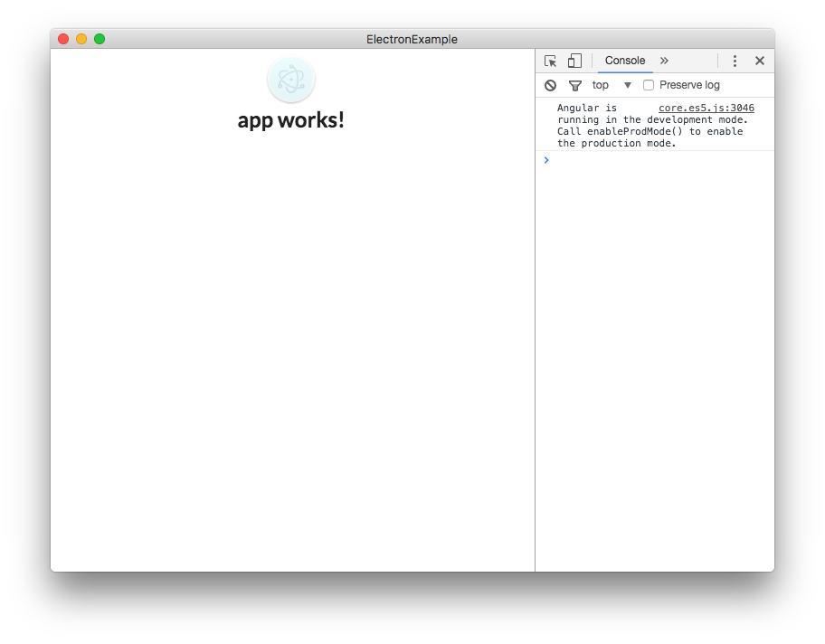

# Build Structure
이제 본격적인 `App`의 구조를 잡아보도록 하겠습니다.

`app.component.html`의 파일을 열어서 다음과 같이 수정합니다.

#### app.component.html
```html
<!-- app.component.html -->
<div class="ui container">
  <h2 class="ui center aligned icon header">
    <div class="content">
      {{title}}
      <div class="sub header">{{subTitle}}</div>
    </div>
  </h2>
</div>
```
### Image 표시하기
#### 첨부 1 electron_icon.png


이제 이미지를 띄워보도록 하겠습니다. 위 이미지를 다운받아 `/src/assets/` 폴더에 `img`라는 폴더를 생성한 뒤 해당 폴더에 저장해 줍니다.

#### File Path
```
Project-Name/src
├── app
└── assets
    └── img
        └── electron_icon.png
└── environment
```

이 후에 `` 태그를 사용하여 경로를 `./assets/img/electron_icon.png`로 설정해 줍니다.

#### app.component.html
```html
<!-- app.component.html -->
<div class="ui container">
  <h2 class="ui center aligned icon header">
    
    <div class="content">
      {{title}}
      <div class="sub header">{{subTitle}}</div>
    </div>
  </h2>
</div>
```

여기까지 오셨으면 다음과 화면이 완성됩니다.



### Data Interpolation :: 데이터 보간
Angular2의 `Interpolation`을 이용해서 멤버 변수를 수정하여 화면에 나오는 문구를 수정해 보도록 하겠습니다.

#### app.component.html
```html
...
<div class="content">
  {{title}}
  <div class="sub header">{{subTitle}}</div>
</div>
...
```
여기서 `{{title}}`과 `{{subTitle}}`을 `Interpolation`이라고 합니다. `.ts`파일의 멤버 변수 값이 저 자리에 그대로 출력되게 됩니다.


#### app.component.ts
```typescript
// app.component.ts
import { Component } from '@angular/core';

@Component({
  selector: 'app-root',
  templateUrl: './app.component.html',
  styleUrls: ['./app.component.css']
})

export class AppComponent {
  // 멤버 변수
  private title = 'app works!';
  private subTitle = 'This app was made for Electron Angular Example';

  clickFunction = () => {
    alert('Click!');
  }
}
```
