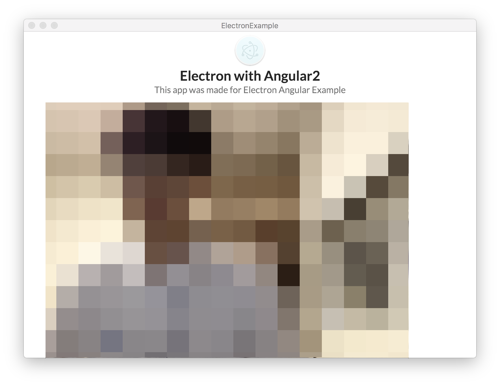

# WebCAM
이번에는 `HTML5`에서 지원하는 `getUserMedia`를 이용해서 화면상에 WebCAM을 띄워보도록 하겠습니다.

웹캠으로 찍히는 화면이 App 내에서 표시될 `<video>`태그를 하나 만들어 줍니다.

#### app.component.html
```html
<div class="ui container">
  <h2 class="ui center aligned icon header">
    
    <div class="content">
      {{title}}
      <div class="sub header">{{subTitle}}</div>
    </div>
  </h2>
  <!-- 이 부분을 추가해 줍니다. -->
  <video id="camera" class="ui fluid" autoplay> </video>
</div>
```

그리고 이제 저 `<video>` 태그에 웹캠 화면을 띄워보도록 하겠습니다.

### Lifecycle ngAfterViewInit

가장 먼저 `ngAfterViewInit()`이라는 `Lifecycle` 훅을 하나 만들어 줍니다.
`ngAfterViewInit()`를 쓰는 이유는 `View`가 초기화 된 이후에 `DOM Element`에 접근할 수 있기 때문입니다.

> Angular2의 Lifecycle의 내용은 <https://angular.io/docs/ts/latest/guide/lifecycle-hooks.html>를 참조하세요.

#### app.component.ts
```typescript
// ngAfterViewInit()을 쓰기 위해서 AfterViewInit를 import 해줍니다.
import { Component, AfterViewInit } from '@angular/core';

@Component({
  selector: 'app-root',
  templateUrl: './app.component.html',
  styleUrls: ['./app.component.css']
})
//                        ↓ AfterViewInit interface를 implements 해줍니다.
export class AppComponent implements AfterViewInit {
  private title = 'Electron with Angular2';
  private subTitle = 'This app was made for Electron Angular Example';

  private video;

  // ngAfterViewInit()를 선언합니다.
  ngAfterViewInit() {

  }

  clickFunction = () => {
    alert('Click!');
  }
}
```

### getUserMedia
`Lifecycle` 준비가 되었다면 이제 웹캠으로 부터 정보를 받아와봅시다.

#### app.component.ts
```typescript
...
ngAfterViewInit() {
  navigator.getUserMedia({video: true, audio: false},
    (stream) => {
      this.video = document.getElementById('camera');
      this.video.srcObject = stream;
     },
    (error) => {
      console.log('Error' + error);
    }
  );
}
...
```

이제 실행해 봅시다. 화면에 자신의 얼굴이 나올 것입니다!



> 여러분의 안구를 위해서 화면은 모자이크 처리를 하였습니다.

### 좌우 반전
화면속에 나오는 얼굴이 일반 스마트폰으로 셀카를 촬영할 때와 느낌이 조금 다를 겁니다. 이유는 흔히 쓰는 셀카 앱은 좌우반전이 되어있기 때문인데요, 여기서도 좌우 반전 효과를 줘 봅시다.

설정 방법은 간단합니다. `#camera`에 `transform: scaleX` 속성을 `-1`로 줘서 좌우반전 효과를 줄 수 있습니다.

#### app.component.css
```css
#camera{
  transform: scaleX(-1);
}
```


