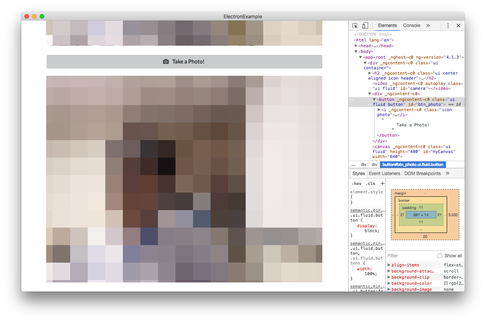
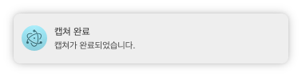

# Capture WebCAM stream
이번에는 WebCAM stream을 `Capture`하는 방법을 살펴보도록 하겠습니다.

일단 `app.component.html`에 캡쳐버튼과 캡쳐된 내용이 표시될 `<canvas>` 태그를 만들어 줍니다.

### Make Capture Button
먼저 캡쳐버튼을 만들어 보도록하겠습니다.

#### app.component.html
```html
<div class="ui container">
  <h2 class="ui center aligned icon header">
    
    <div class="content">
      {{title}}
      <div class="sub header">{{subTitle}}</div>
    </div>
  </h2>
  <video #camera class="ui fluid" autoplay> </video>
  <!-- 이 부분을 추가해 줍니다. -->
  <button id="btn_photo" class="ui fluid button" (click)="takePhoto()">
    <i class="icon photo"></i>
    Take a Photo!
  </button>
  <canvas #myCanvas class="ui fluid" width="640" height="480"></canvas>
</div>
```

#### app.component.css
```css
#camera{
  transform: scaleX(-1);
}

.fluid {
  margin-bottom: 20px;
  width: 100%;
}
```

이와 같이 잘 따라오셨다면 아래와 같은 화면이 나오게됩니다.


### Show the capture image in Canvas
다음은 캡처버튼이 클릭되었을 때 캡쳐된 내용을 `<canvas>` 태그에 표시하는 작업을 해보겠습니다.

먼저 `app.component.ts`를 열어서 `canvas`와 canvas의 내용이 들어갈 `ctx`를 멤버 변수로 선언해줍니다. 그 다음 데이터가 들어갈 수 있도록 아래와 같은 작업을 해줍니다.

#### app.component.ts
```typescript
...
export class AppComponent implements AfterViewInit {
  private title = 'Electron with Angular2';
  private subTitle = 'This app was made for Electron Angular Example';

  @ViewChild('camera') video;
  @ViewChild('myCanvas') canvas;
  private ctx;

  ngAfterViewInit() {
    const _video = this.video.nativeElement;

    // canvas 초기화
    const _canvas = this.canvas.nativeElement;
    // ctx 초기화
    this.ctx = this.canvas.getContext('2d');

    // ctx 좌우 반전
    this.ctx.translate(this.canvas.width, 0);
    this.ctx.scale(-1, 1);

    navigator.getUserMedia({video: true, audio: false},
      (stream) => {
        _video.srcObject = stream;
       },
      (error) => {
        console.log('Error' + error);
      }
    );
  }

  // btn_photo에 바인딩할 takePhoto() 함수 정의하기
  takePhoto = () => {
    const _video = this.video.nativeElement;
    const _canvas = this.canvas.nativeElement;

    // 캡쳐된 화면 그리기
    this.ctx.drawImage(_video, 0, 0, _canvas.width, _canvas.height);
  }
...
```



### Notification 만들기
Electron은 기본적으로 `Notification`을 지원합니다.

만드는 방법은 간단합니다.

```typescript
new Notification('title', {body: 'message'});
```

이제 `btn_photo`가 눌릴 경우 `Notification`을 띄워보도록 하겠습니다.

#### app.component.ts
```typescript
...
takePhoto = () => {
  const _video = this.video.nativeElement;
  const _canvas = this.canvas.nativeElement;

  this.ctx.drawImage(_video, 0, 0, _canvas.width, _canvas.height);
  new Notification('캡쳐 완료', {body: '캡쳐가 완료되었습니다.'});
}
```

이제 `btn_photo`를 누를 경우에 아래와 같은 `Notification`이 뜨는 것을 확인할 수 있습니다.



### [이전 게시물 :: Show WebCAM stream in Electron](chapter5.md)
### [다음 게시물 :: Detect Face with Cognitive API](chapter7.md)
