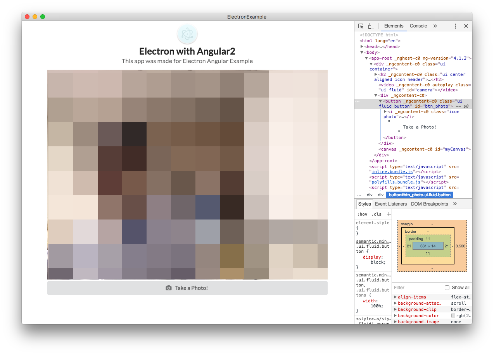

# Capture WebCAM stream
이번에는 WebCAM stream을 `Capture`하는 방법을 살펴보도록 하겠습니다.

일단 `app.component.html`에 캡쳐된 내용이 표시될 `<canvas>` 태그와 캡쳐버튼을 만들어 줍니다.

#### app.component.html
```html
<div class="ui container">
  <h2 class="ui center aligned icon header">
    
    <div class="content">
      {{title}}
      <div class="sub header">{{subTitle}}</div>
    </div>
  </h2>
  <video id="camera" class="ui fluid" autoplay> </video>
  <!-- 이 부분을 추가해 줍니다. -->
  <button id="btn_photo" class="ui fluid button" (click)="takePhoto()">
    <i class="icon photo"></i>
    Take a Photo!
  </button>
  <canvas id="myCanvas"></canvas>
</div>
```

#### app.component.css
```css
#camera{
  transform: scaleX(-1);
}

.fluid {
  width: 100%;
}
```

이와 같이 잘 따라오셨다면 아래와 같은 화면이 나오게됩니다.


