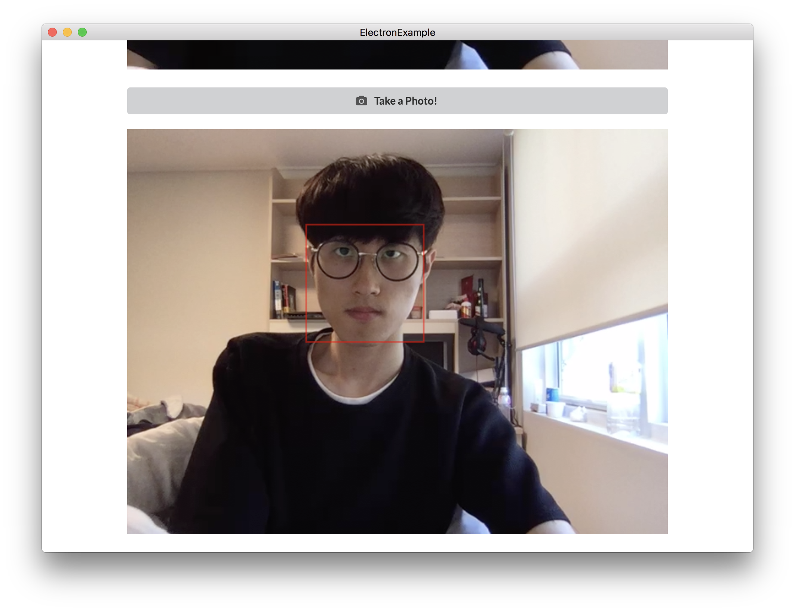
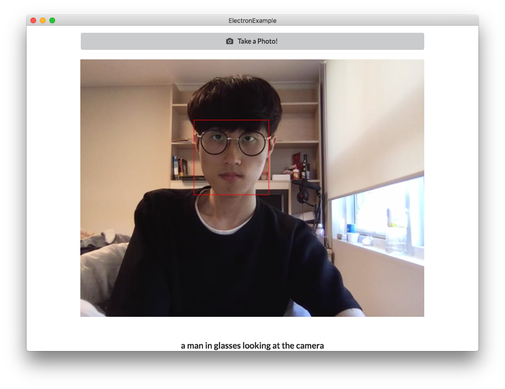
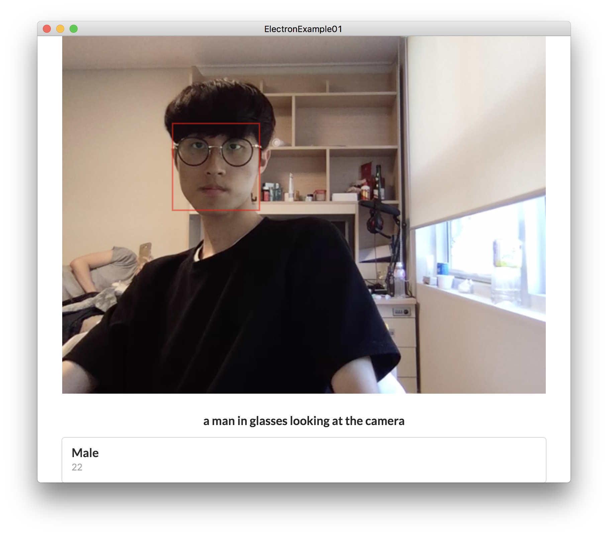

# Detect Face with Cognitive API

이번 문서에서는 `Angular2`에서 `HTTP` 통신을 이용하여 `Cognitive API`를 사용하는 방법을 소개하도록 하겠습니다.

> Cognitive API는 <https://azure.microsoft.com/en-us/try/cognitive-services/>에서 KEY를 발급받을 수 있습니다.


```typescript
const faceKey = 'c8a88151c9c84934aef42a17c161eb5f';
const emotionKey = 'c73ae0c7b3054f2e9578c20630e76ef3';
```

### Service 모듈 만들기
`Angular2`에서 `HTTP` 통신을 이용하기 위해서는 `Service`를 만들어야합니다.

`/src/app/`폴더에 `app.service.ts`를 하나 만들어 줍니다.

#### app.service.ts
```typescript
import { Injectable } from '@angular/core';
import { Headers, Http } from '@angular/http';

@Injectable()
export class AppService {

  constructor(private http: Http) {

  }

  postRequest(url: string, apiKey, img) {
    const headers = new Headers();
    headers.append('Content-Type', 'application/octet-stream');
    headers.append('Ocp-Apim-Subscription-Key', apiKey);
    return this.http.post(url, img, {headers: headers});
  }

}
```

### Service 모듈 등록하기
만든 `Service`모듈을 이제 등록시켜줍니다.

#### app.module.ts
```typescript
import { BrowserModule } from '@angular/platform-browser';
import { NgModule } from '@angular/core';
import { FormsModule } from '@angular/forms';
import { HttpModule } from '@angular/http';

import { AppComponent } from './app.component';
// Appservice 를 import 한 뒤
import { AppService } from './app.service';

@NgModule({
  declarations: [
    AppComponent
  ],
  imports: [
    BrowserModule,
    FormsModule,
    HttpModule
  ],
  // providers에 AppService를 등록해줍니다.
  providers: [AppService],
  bootstrap: [AppComponent]
})

export class AppModule { }
```

그리고 이제 `<canvas>`에 있는 바이너리 코드를 `Blob`으로 만들어 `Cognitive API`로 전송합니다.

#### app.component.ts
```typescript
import { Component, AfterViewInit, ViewChild } from '@angular/core';
import { AppService } from './app.service';

...

export class AppComponent implements AfterViewInit {

  ...
  @ViewChild('camera') video;
  @ViewChild('myCanvas') canvas;
  private ctx;
  ...

  constructor(private appService: AppService) {}

  ngAfterViewInit() {
    ...
  }

  // Blob으로 만들어 주기 위한 함수
  dataURLtoBlob = (dataurl) => {
    const arr = dataurl.split(','), mime = arr[ 0 ].match(/:(.*?);/)[ 1 ];
    const bstr = atob(arr[ 1 ]);
    let n = bstr.length;
    const u8arr = new Uint8Array(n);
    while (n--) {
      u8arr[ n ] = bstr.charCodeAt(n);
    }
    return new Blob([ u8arr ], { type: 'application/octet-stream' });
  }

  takePhoto = () => {
    this.ctx.drawImage(_video, 0, 0, _canvas.width, _canvas.height);
    new Notification('캡쳐 완료', {body: '캡쳐가 완료되었습니다.'});

    // canvas의 바이너리를 blob으로 변환
    const imgData = _canvas.toDataURL('image/jpeg', 1.0);
    const blob = this.dataURLtoBlob(imgData);

    const faceURL = 'https://api.projectoxford.ai/vision/v1.0/analyze?visualFeatures=Description,Faces&language=en';
    const emotionURL = 'https://westus.api.cognitive.microsoft.com/emotion/v1.0/recognize';

    const faceKey = 'YOUR_API_KEY';
    const emotionKey = 'YOUR_API_KEY';

    this.appService.postRequest(faceURL, faceKey, blob).subscribe((data) => {
        const resultJson = JSON.parse(data['_body']);
        console.log(resultJson);
    })

    this.appService.postRequest(emotionURL, emotionKey, blob).subscribe((data) => {
        const resultJson = JSON.parse(data['_body']);
        console.log(resultJson);
    })
  }
}
```

지금과는 다르게 약간 난이도가 있는 부분이었습니다.

여기까지 잘 따라 오셨다면 아래와 같은 결과 값이 나오게 됩니다.


### 얼굴 부분 강조하기
이번에는 얼굴 영역을 붉은 색 테두리로 표시하는 방법을 알아보도록 하겠습니다.

`Cognitive API`를 이용해서 얻은 값의 구조를 들여다 보면, 아래와 같습니다.

```
Object
├── description
├── faces
    └── face
        ├── age
        ├── faceRectangle
        └── gender
└── metadata
```

여기서 우리가 써야할 값은 `faceRectangle` 입니다.

```typescript
...
this.appService.postRequest(faceURL, faceKey, blob).subscribe((data) => {
    const resultJson = JSON.parse(data['_body']);
    console.log(resultJson);

    for (const face of resultJson['faces']) {
      const faceRect = face['faceRectangle'];
      // 붉은 색 테두리로 표시
      this.ctx.strokeStyle = '#FF0000';
      // 사각형 좌표를 입력하여 테두리 그리기
      this.ctx.strokeRect(640 - parseInt(faceRect[ 'left' ], 0) - parseInt(faceRect['width'], 0) , faceRect[ 'top' ],
          faceRect[ 'width' ], faceRect[ 'height' ]);
    }

    // 얼굴 인식 개수에 따른 Notification 메시지 처리
    const n = resultJson['faces'].length;
    if(n > 0){
      new Notification('얼굴 인식 완료', {body: n + '명의 얼굴을 표시하였습니다.'});
    }
    else {
      new Notification('얼굴 인식 실패', {body: '얼굴을 찾지 못하였습니다.'});
    }
})
...
```

> 640 - parseInt(faceRect[ 'left' ], 0) - parseInt(faceRect['width'], 0) 부터 시작하는 이유는 좌우가 반전되어있기 때문입니다.



화면에 얼굴 인식 사각형까지 그리는 것을 완료하였습니다.

### Cognitive 결과 값을 화면에 출력하기
이제 나머지 결과 값을 화면에 출력해보도록 하겠습니다.

가장 먼저 `description`을 표시할 `<h3>`태그를 만들어 줍니다.
#### app.component.html
```html
<div class="ui container">
  ...
  <canvas #myCanvas class="ui fluid" width="640" height="480"></canvas>
  <!-- description을 표시할 h3 태그 -->
  <h3 class="ui center aligned header">{{description}}</h3>
</div>
```
그 다음으로는 `description`을 멤버 변수로 선언해줍니다.

#### app.component.ts

```typescript
private description;
...
this.appService.postRequest(faceURL, faceKey, blob).subscribe((data) => {
  ...
  this.description = resultJson['description']['captions'][0]['text'];
}
```




### ngFor을 이용한 여러개의 정보 표시하기
이번에는 `ngFor`을 사용해보도록 하겠습니다.

지금은 하나의 얼굴을 인식하기 때문에 한 명의 정보만 나오지만, 기본적으로 `Cognitive API`는 여러명의 얼굴도 인식할 수 있습니다.
여러명의 얼굴을 인식하게 될 경우에는 `faces`에 객체가 여러개 리턴되기 때문에 이를 다 표시해주기 위해서는 반복문을 사용해야합니다.

`ngFor`을 이용하는 방법은 간단합니다.

일단 `faces`라는 멤버 변수를 하나 생성합니다.

#### app.component.ts
```typescript
export class AppComponent implements AfterViewInit {
  ...
  // faces라는 새로운 멤버 변수를 선언
  private faces;

  takePhoto = () => {
    ...
    this.appService.postRequest(faceURL, faceKey, blob).subscribe((data) => {\
      const resultJson = JSON.parse(data['_body']);
      ...
      this.faces = resultJson['faces'];
      ...
    }
  }
}
...
```

그리고 템플릿에서 `ngFor`을 사용합니다.

```html
<div class="ui container">
  ...
  <h3 class="ui center aligned header">{{result}}</h3>
  <div class="ui fluid card" *ngFor="let face of faces">
    <div class="content">
      <div class="header">{{face['gender']}}</div>
      <div class="meta">{{face['age']}}</div>
    </div>
  </div>
</div>
```

자, 그럼 아래와 같이 얼굴이 인식된 정보가 하단에 표시되게 됩니다.


여기까지 `Electron`과 `Angular2` 그리고 `Typescript`를 이용하여 얼굴인식 앱을 만들어 봤습니다.
모두 봐주셔서 감사합니다.

### [이전 게시물 :: Capture WebCAM stream](chapter6.md)
