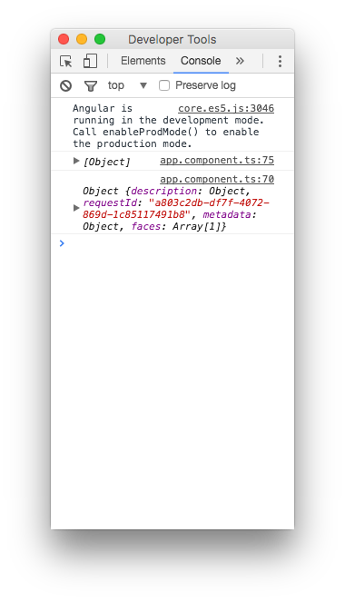

# Cognitive with HTTP

이번 문서에서는 `Angular2`에서 `HTTP` 통신을 이용하여 `Cognitive API`를 사용하는 방법을 소개하도록 하겠습니다.

> Cognitive API는 <https://azure.microsoft.com/en-us/try/cognitive-services/>에서 KEY를 발급받을 수 있습니다.

### Service 모듈 만들기
`Angular2`에서 `HTTP` 통신을 이용하기 위해서는 `Service`를 만들어야합니다.

`/src/app/`폴더에 `app.service.ts`를 하나 만들어 줍니다.

#### app.service.ts
```typescript
import { Injectable } from '@angular/core';
import { Headers, Http } from '@angular/http';

@Injectable()
export class AppService {

  constructor(private http: Http) {

  }

  postRequest(url: string, apiKey, img) {
    const headers = new Headers();
    headers.append('Content-Type', 'application/octet-stream');
    headers.append('Ocp-Apim-Subscription-Key', apiKey);
    return this.http.post(url, img, {headers: headers});
  }

}
```

### Service 모듈 등록하기
만든 `Service`모듈을 이제 등록시켜줍니다.

#### app.module.ts
```typescript
import { BrowserModule } from '@angular/platform-browser';
import { NgModule } from '@angular/core';
import { FormsModule } from '@angular/forms';
import { HttpModule } from '@angular/http';

import { AppComponent } from './app.component';
// Appservice 를 import 한 뒤
import { AppService } from './app.service';

@NgModule({
  declarations: [
    AppComponent
  ],
  imports: [
    BrowserModule,
    FormsModule,
    HttpModule
  ],
  // providers에 AppService를 등록해줍니다.
  providers: [AppService],
  bootstrap: [AppComponent]
})

export class AppModule { }
```

그리고 이제 `<canvas>`에 있는 바이너리 코드를 `Blob`으로 만들어 `Cognitive API`로 전송합니다.

#### app.component.ts
```typescript
import { Component, AfterViewInit } from '@angular/core';
import { AppService } from './app.service';

...

export class AppComponent implements AfterViewInit {

  ...
  private video;
  private canvas;
  private ctx;
  ...

  constructor(private appService: AppService) {}

  ngAfterViewInit() {
    ...
  }

  // Blob으로 만들어 주기 위한 함수
  dataURLtoBlob(dataurl) {
     const arr = dataurl.split(','), mime = arr[ 0 ].match(/:(.*?);/)[ 1 ];
     const bstr = atob(arr[ 1 ]);
     let n = bstr.length;
     const u8arr = new Uint8Array(n);
     while (n--) {
       u8arr[ n ] = bstr.charCodeAt(n);
     }
     return new Blob([ u8arr ], { type: 'application/octet-stream' });
  }

  takePhoto = () => {
    this.ctx.drawImage(this.video, 0, 0, this.canvas.width, this.canvas.height);
    new Notification('캡쳐 완료', {body: '캡쳐가 완료되었습니다.'});

    // canvas의 바이너리를 blob으로 변환
    const imgData = this.canvas.toDataURL('image/jpeg', 1.0);
    const blob = this.dataURLtoBlob(imgData);

    const faceURL = 'https://api.projectoxford.ai/vision/v1.0/analyze?visualFeatures=Description,Faces&language=en';
    const emotionURL = 'https://westus.api.cognitive.microsoft.com/emotion/v1.0/recognize';

    const faceKey = 'YOUR_API_KEY';
    const emotionKey = 'YOUR_API_KEY';

    this.appService.postRequest(faceURL, faceKey, blob).subscribe((data) => {
        const resultJson = JSON.parse(data['_body']);
        console.log(resultJson);
    })

    this.appService.postRequest(emotionURL, emotionKey, blob).subscribe((data) => {
        const resultJson = JSON.parse(data['_body']);
        console.log(resultJson);
    })
  }
}
```

지금과는 다르게 약간 난이도가 있는 부분이었습니다.

여기까지 잘 따라 오셨다면 아래와 같은 결과 값이 나오게 됩니다.


